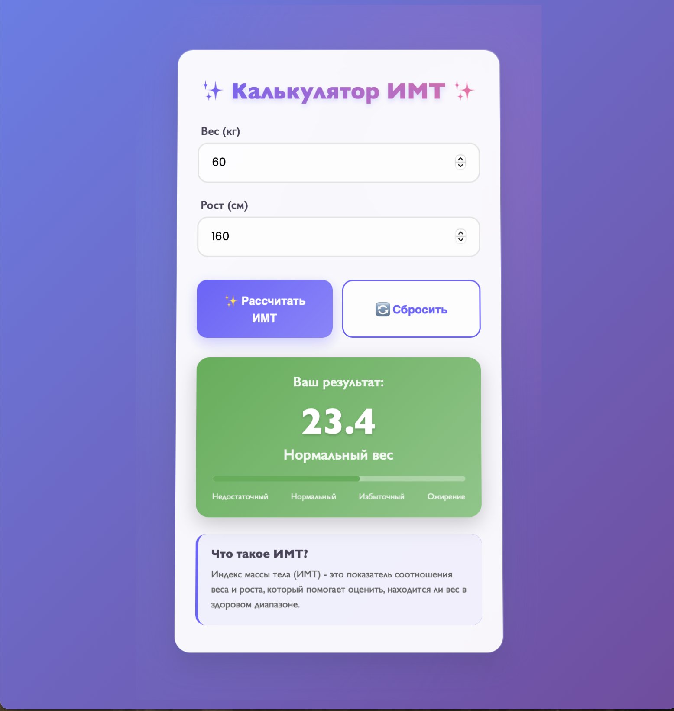

# 📋 README - Калькулятор ИМТ

## 🎯 Описание проекта

**Калькулятор ИМТ** - это интерактивное React-приложение для расчета индекса массы тела с красивым, современным дизайном и плавными анимациями. Приложение помогает пользователям быстро и наглядно оценить свой вес относительно роста.


## Основные возможности

- 🔢 **Ввод данных** - вес (кг) и рост (см)
- 🧮 **Автоматический расчет** ИМТ по стандартной формуле
- 🎨 **Визуальная категоризация** результатов с цветовой индикацией
- 📊 **Интерактивная шкала** прогресса
- 🔄 **Анимированные переходы** и эффекты
- 📱 **Адаптивный дизайн** для мобильных устройств
- ♻ **Сброс результатов** и повторный расчет

## 🛠 Технологический стек

- **Frontend**: React 18.2.0
- **Build Tool**: Vite 4.4.0
- **Styling**: Pure CSS с анимациями
- **Icons**: Emoji и CSS эффекты
- **Fonts**: Google Fonts (Poppins)

##  Скриншоты приложения

### 💫 Главный экран с формой ввода

*Интерфейс с полями для ввода веса и роста*

### 📈 Результаты расчета

*Пример расчета с нормальным весом*

### 🎭 Разные категории ИМТ
| Недостаточный вес | Нормальный вес | Избыточный вес | Ожирение |
|-------------------|----------------|----------------|----------|
|  |  |  |  |

## 🚀 Быстрый старт

### Предварительные требования
- Node.js (версия 14 или выше)
- npm или yarn

### Установка и запуск

1. **Клонирование репозитория**
```bash
git clone https://github.com/your-username/bmi_easy_calculator.git
cd bmi_easy_calculator
```

2. **Установка зависимостей**
```bash
npm install
```

3. **Запуск в режиме разработки**
```bash
npm run dev
```

4. **Открыть в браузере**
```
http://localhost:3000
```

### Сборка для production
```bash
npm run build
npm run preview
```

## 📁 Структура проекта

```
bmi_easy_calculator/
├── src/
│   ├── components/
│   │   └── BMICalculator.jsx      # Основной компонент калькулятора
│   ├── styles/
│   │   ├── index.css              # Глобальные стили
│   │   ├── App.css                # Стили главного компонента
│   │   └── BMICalculator.css      # Стили калькулятора
│   ├── utils/
│   │   └── bmiCalculator.js       # Логика расчета ИМТ
│   ├── App.jsx                    # Корневой компонент
│   └── main.jsx                   # Точка входа
├── public/
├── index.html                     # HTML шаблон
├── package.json                   # Зависимости и скрипты
├── vite.config.js                 # Конфигурация Vite
└── README.md                      # Документация
```

## Особенности реализации

### Компонентная архитектура
```jsx
const BMICalculator = () => {
  const [weight, setWeight] = useState('')
  const [height, setHeight] = useState('')
  const [bmi, setBmi] = useState(null)
  // ... остальные состояния
}
```

### Управление состоянием
- **useState** для управления данными формы и результатами
- **Условный рендеринг** для отображения результатов
- **Обработчики событий** для форм и кнопок

### Анимации и UX
- CSS transitions для плавных эффектов
- Анимация загрузки при расчете
- Hover-эффекты для интерактивности
- Адаптивная верстка

### Логика расчета
```javascript
export const calculateBMI = (weight, height) => {
  const heightInMeters = height / 100
  const bmi = weight / (heightInMeters * heightInMeters)
  return bmi.toFixed(1)
}
```

## 🎯 Ключевые функции React

### ✅ Работа с компонентами
- Функциональные компоненты с хуками
- Разделение ответственности между компонентами
- Переиспользуемая структура

### ✅ Управление состоянием
- Хук useState для реактивного состояния
- Подъем состояния при необходимости
- Локальное состояние компонентов

### ✅ Обработка событий
- Обработчики onSubmit для формы
- Обработчики onChange для input полей
- Обработчики onClick для кнопок

### ✅ Утилиты и хранение данных
- Отдельный модуль для бизнес-логики
- Локальное хранение состояния
- Валидация ввода

## 📊 Формула расчета ИМТ

```
ИМТ = вес (кг) / (рост (м) × рост (м))
```

**Категории ИМТ:**
- ⚠️ Менее 18.5 - Недостаточный вес
- ✅ 18.5 - 24.9 - Нормальный вес  
- ⚠️ 25 - 29.9 - Избыточный вес
- ❌ 30 и более - Ожирение

## 🎨 Дизайн-система

### Цветовая палитра
- **Основной**: `#6C63FF` (фиолетовый)
- **Успех**: `#4CAF50` (зеленый)
- **Предупреждение**: `#FF9800` (оранжевый)
- **Ошибка**: `#F44336` (красный)
- **Фон**: Градиент `#667eea` to `#764ba2`

### Типографика
- **Шрифт**: Poppins (300, 400, 500, 600, 700)
- **Размеры**: Адаптивная типографика

## 🔧 Производительность

- ⚡ Быстрая сборка с Vite
- 🎯 Оптимизированные анимации CSS
- 📦 Минимальный bundle размер
- 🚀 Lazy loading готов к реализации

## 🐛 Отладка и разработка

Для отладки используйте React DevTools и браузерные инструменты разработчика. Приложение включает строгий режим React для выявления потенциальных проблем.

## 📝 Выводы по проекту

### ✅ Достигнутые цели
- Создано полнофункциональное React-приложение
- Реализован красивый и интуитивный интерфейс
- Достигнута высокая производительность и отзывчивость
- Применены лучшие практики React разработки

### 🎓 Приобретенные навыки
- Глубокая работа с React hooks (useState)
- Создание сложных CSS анимаций
- Управление состоянием приложения
- Работа с формами и валидацией
- Оптимизация пользовательского опыта

### 🔮 Возможности улучшения
- Добавление истории расчетов
- Локализация на разные языки
- PWA функциональность
- Интеграция с бэкендом для сохранения данных

---

**⭐ Если этот проект был полезен, поставьте звезду на GitHub!**

---

*Последнее обновление: ${new Date().strftime("%d.%m.%Y")}*
